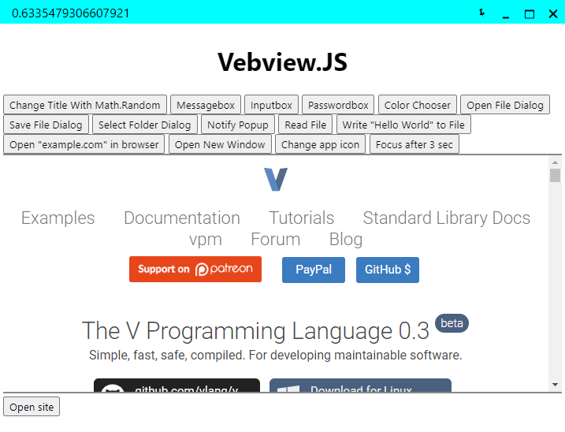

#  Vebview.JS

<div align="center"></div>

| **Works Everywhere** | **Small App Bundles, Really** |
|------------------|--------------------|
| Applications written with Vebview.JS can work any modern PC runs x64 and even move with any storage device without data loss¹. | App bundles size is lower than 1MB, smaller 100+ times than NW.JS or Electron |
| **Powered by Web Technologies** | **Free & Open Source** |
| Create applications with HTML, CSS or JS | No cost, Not everything good is paid |
| **Native API** | **Built on V** |
| APIs that allow move beyond the Web borders | One of the Safe and Performance languages |
| **Multiple backend support** | **Browser API Pollfills** |
| Localhost, file protocol, custom backend (php, ruby, python, etc.) and cloud (such as from a website) | Port your Web App or PWA into an executable easily. |

¹:Except writing/reading files specific locations, deleting data files and using browser based storage (like localstorage)

Roadmap & What's implemented?

> You can learn from [support.md](./support.md)

## How to compile?

> No require Administrator permission or Root permission. *YOU SHOULD **NOT** RUN AS ADMINISTRATOR OR ROOT*

### **Linux**
```bash
$ export V_LOC=/path/to/dir/v
$ ./linux.sh
```

### **Windows**
```cmd
> set V_LOC=C:/path/to/dir/v
> set W10_SDK=C:/path/to/dir/sdk :: for example; C:/Program\ Files\ \(x86\)/Windows\ Kits/10/Include/10.0.22621.0
> ./windows.cmd
```

<!-- Cross-Compiling possible but not recommend for now
### **Windows On Linux (Cross-Compiling)**
```bash
$ export V_LOC=/path/to/dir/v
$ export W10_SDK=/path/to/dir/sdk
$ ./windows_on_linux.sh
```
-->

## License

> This project licensed by [Apache License 2.0](./LICENSE).
* [Tinyfiledialogs](https://sourceforge.net/projects/tinyfiledialogs/)(Patched) licensed by ZLib licence.
* [Webview](https://github.com/malisipi/vebview-webview) licensed by MIT License.
* [Webview2 (1.0.1264.42)](https://www.nuget.org/packages/Microsoft.Web.WebView2/) -&gt; [license](./libs/webview2/LICENSE.txt)
* [Keybinder](https://github.com/kupferlauncher/keybinder) licensed by MIT License.

## Known Bugs

* On Windows
    * ~~vebview.window.move can't move window to correct position when monitor scaled. _WindowWidth/window.innerWidth gives display scale, (moveX,moveY)*thisValue could be fix that, but not implemented yet_~~ That fixed temporarily with disabling enable_dpi_awareness. That causes blurry window while enabled dpi system-wide.
* On Linux
    * There're no known bug :)
* On App Bundles
    * Storage is temporary, can not save data. Causes write permission. (Windows & Linux)
    * SetProgress is not work. Causes write permission. (Linux)

> If you find a bug, open new issue.
